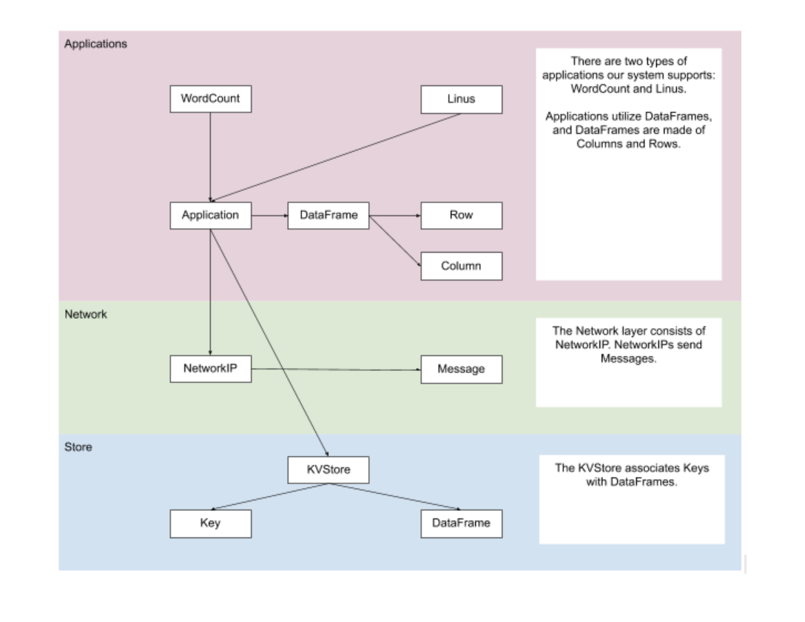
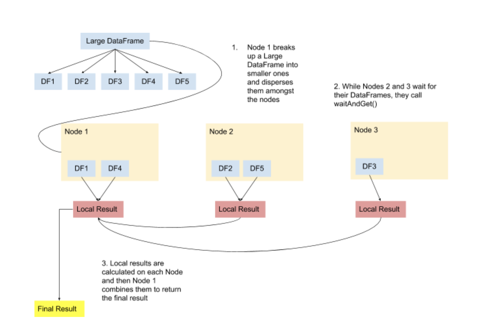

# eau2 System Architecture Document #
## Introduction ##
In this document we will describe the architecture and implementation of the eau2 system.
Thus far, the eau2 system is able to read in SoR files and construct DataFrames, our system's internal representation
of columnar SoR files. The system also contains a Key Value Store which is a hash-map like structure which can associate Keys with DataFrames.
We have also created the ability to create client and server nodes which can pass Messages containing information
about other nodes and data stored in DataFrames. Users can also select Applications to be run on the eau2 system.
In the following sections we will discuss these features in more technical detail as well as
describe the future work involved. 
## Architecture ##
_In the following diagrams, we describe the various mechanics and pieces of eau2 at a high-level._



## Implementation ##
In this section, we describe how the system is built. Currently the functionality for each milestone is available, but not connected.
### Team 4500NE's Sorer
In this project, we utilized [Team 4500NE's sorer](https://github.ccs.neu.edu/euhlmann/CS4500-A1-part1). This sorer had the benefit
of already being written in CwC which ours was not. Team 4500NE had their own definition of Column, which can be found in 
column_prov.h. In our application, we use their sorer to parse a given SoR file into their definition of Column. We then translate
those columns into our definition of DataFrame. By executing the program in this way, we preserve the sanctity of Team 4500NE's
code, and do not have to retest their already tested functionality.  
### Application ###
The Application class is an interface which can be extended by the different applications. An
application essentially is the desired program the user wants to execute. For example,
WordCount is one such Application. The Application class contains a KVStore, an index which
is the index of the node the Application is being run on, and a NetworkIP which communicates
with the other nodes. An Application is run on every node. 
#### Run - How eau2 interacts with the Network ####
The Application's run method executes the desired functionality of the app. In our design, the run method also is used for interacting with
other nodes to send and receive DataFrames. There are three phases:
1. The server distributes DataFrames of size rowsperchunk to the nodes.
2. All nodes, including the server, execute the app functionality on their given DataFrames and produce a result.
3. The nodes send their result back to the server who merges each nodes results to produce a final result.

This process is depicted in the above diagrams.
#### Supported Applications ####
##### WordCount #####
Returns the number of different words in a text file. To select this application use the flag "-app "wc"".
##### Linus #####
Returns the number of people who worked on projects up to seven degrees of Linus Torvalds. 
To select this application use the flag "-app "linus"".
### KVStore
The KVStore class found in kvstore.h represents a Key Value Store. KVStore contains an array of Key* and DataFrame*, as well as a size. 
The KVStore contains three methods: get, put, and getAndWait. get takes in a Key and returns the DataFrame associated with that Key in the store.
put adds a given Key and DataFrame to the KVStore arrays and increases the size. The getAndWait method is yet to be finished. Ultimately, the KVStore is very similar to a hashmap.
### DataFrame
The most important file in our program is dataframe.h. A DataFrame
consists of a list of Columns. There are four types of Columns: IntColumn, 
BoolColumn, FloatColumn, and StringColumn. Each Column contains an array of values of its kind.
Primarily in our program we use the push_back method to add elements to Columns. DataFrame's also contain a Schema,
which describes the columns in a DataFrame. For example, a DataFrame consisting of an IntColumn, BoolColumn, FloatColumn, and StringColumn in that order
would have a Schema with a types String of "IBFS". 

To interact with the sorer, we created a special DataFrame constructor which creates an instance of a DataFrame using Team 4500NE's sorer. In this system,
we assume that DataFrame's will not need to be modified once constructed. 

Another important method on DataFrame is the fromArray method. This method constructs a DataFrame from a given array of doubles and 
adds it to the given KVStore under the given Key. It then returns the constructed DataFrame.
### NetworkIP ###
The NetworkIP class allows us to utilize socket programming to send Messages between nodes. There are two main methods in
NetworkIP, server_init and client_init. There are four types of Messages: Ack which acknowledges the receipt of a Message, Status which we use to send DataFrames, 
Register which a client sends to a server upon coming online, and Directory which a server sends to a client after receiving a Register 
Message. server_init sets up a NetworkIP to act as a server, which means it sends waits to receive Register Messages from
every client and then send them all Directory Messages. client_init sets up a NetworkIP to act as a client, which means it
sends the server a Register method and waits to receive a Directory Message in response. 
### Readers and Writers ###
Readers are used to read DataFrames. Writers are used to construct/modify DataFrames. 
## Use cases ##
```
//====================TO BUILD:=====================
make build
//====================TO RUN:=====================
//To run you must include the following flags:
-index : the index of this node
-file : if you are running WordCount, you must provide this flag with the desired text file to count
-node : the number of nodes
-port : the port of this node
-masterip : the ip address of the server (node 0)
-masterport : the port of the server (node 0)
-app : enter "wc" for WordCount or "linus" for Linus
-rowsperchunk : determines how large the DataFrames that are being distributed are
//EXAMPLE:
./eau2 -index 0 -file data/100k.txt -node 3 -port 8080 -masterip "127.0.0.4" -app "wc" -rowsperchunk 10 -masterport 8080

////====================OTHER FUNCTIONALITY:=====================
//Creating a new KVStore
KVStore kv = *new KVStore();

//Initializing some variables
size_t SZ = 1000*1000;
double* vals = new double[SZ];
double sum = 0;
for (size_t i = 0; i < SZ; ++i) sum += vals[i] = i;

//Creating a new Key
Key key("triv",0);

//Creating a DataFrame consisting of the doubles in vals using the static fromArray method.
//The fromArray method also associates df with key in the KVStore
DataFrame* df = DataFrame::fromArray(&key, &kv, SZ, vals);
//Checking to see if the DataFrame was set with the correct values from vals
assert(df->get_double(0,1) == 1);
//The fromVisitor is the same idea but takes in a Writer instead of doubles

//A String-Integer Map
SIMap map;
//A Reader
Adder add(map);
// Visits the rows in the DataFrame and adds them to the Reader's Map
df->local_map(add);

//Retrieving the DataFrame associated with key from the KVStore
DataFrame* df2 = kv.get(key);
for (size_t i = 0; i < SZ; ++i) sum -= df2->get_double(0,i);
//The values in df2 are the same as df
assert(sum==0);

//Initializing a client with index 1 and an IP address of 127.0.0.2 who's server is at IP address 127.0.0.1
//In this example, the client and the client's server are both on port 8080
NetworkIP* client = new NetworkIP();
client->client_init(1, 8080, "127.0.0.1", 8080, "127.0.0.2");

//Initializing a server on port 8080 with an index of 0 (since it is the server)
NetworkIP* server = new NetworkIP();
server->server_init(0, 8080);

//Creating a WordCount Application on a server (index of servers is 0)
WordCount* wc = new WordCount(0, server);
//Calling WordCount's run method which executes its functionality
wc.run();
```
## Open questions ##
* How can we better manage our memory?
* How can we make our program more efficient?
## Status ##
| Milestone Number | Status  | Objective  |
|:---:|:---:|:---|
| 1 | ✓ | Be able to build a DataFrame from a SoR file |
| 2 | ✓ | Implement get, put, and getAndWait on a single-node Key Value Store system |
| 3 | ✓  | Distribute the key value store; be able to run with multiple KV stores, and thus multiple instances of the application |
| 4 | ✓ | Incorporate the network layer
| 5 | .5 | Complete any missing bits in our implementation and write the distributed application "7 degrees of Linus"
